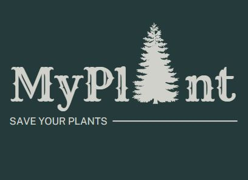
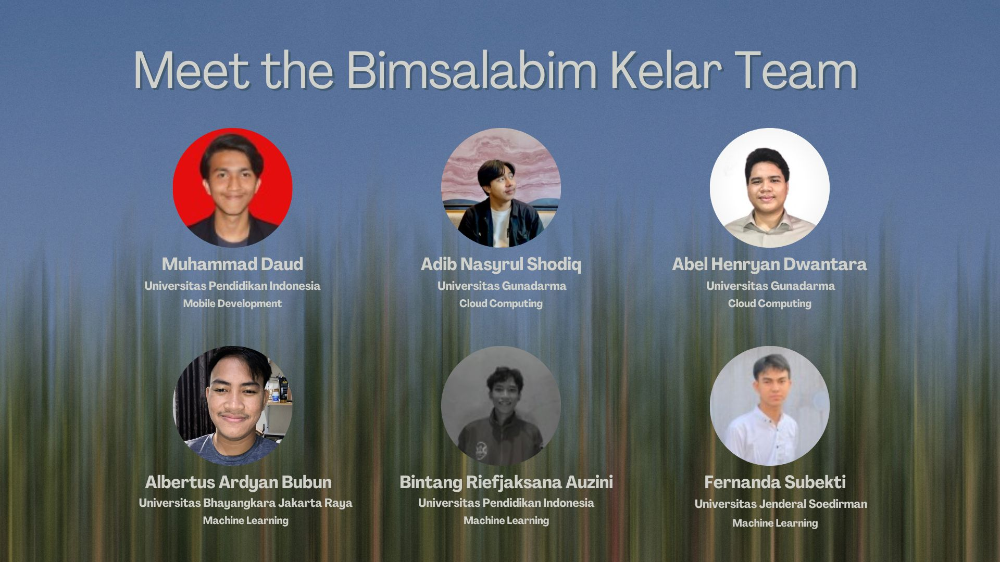

<!-- Qustomate -->

  
  <h2 align="center"><a href="https://github.com/My-Plant/MyPlant-Capstone.git">MyPlant</a></h2>
  
© C23-PS104 Bangkit Capstone Team

# Team Members

## Team ID : C23-PS104
                   

 

| Name                        | Student ID  | Path                |
| ----------------------      | ----------  | ------------------- |
| Abel Henryan Dwantara       | C172DSX2208 | Cloud Computing     |    
| Adib Nasyrul Shodiq         | C172DSX2373 | Cloud Computing     |
| Albertus Ardyan Bubun       | M147DKX4332 | Machine Learning    |
| Bintang Riefjaksana Auzini  | M309DSX2573 | Machine Learning    | 
| Fernanda Subekti            | M210DSX0433 | Machine Learning    | 
| Muhammad Daud               | A309DSX2847 | Android Development |
 

                                                 
### Mentor & Advisor
- <strong>Muhammad Aji Guna Darmawan</strong> (Tech - Android/Mobile Development, Project Management)
- <strong>Dicky Satriawan</strong> (Tech - Cloud and Back End, Business/Commerce/Ideation, Ideation/UI & UX)
                                                 
                                                 
## Table of Contents
- [About The Project](#about-the-project)
- [App Overview](#app-overview)
- [Documentation](#documentation)

## About The Project

Plant diseases pose a significant threat to global food security and agricultural productivity. They can be caused by pathogens and abiotic factors, resulting in yield losses, reduced crop quality, and economic impacts. To combat these diseases, various strategies are employed, but their efficacy varies depending on the specific disease and plant species involved. Understanding the causes and mechanisms of plant diseases is crucial for developing effective management strategies. To address this problem, our team aims to develop the MyPlant application, which utilizes photos to identify plant diseases, provides descriptions of the detected diseases, and offers solutions to help users overcome them. This application will empower individuals to tackle plant diseases, contributing to improved food security and agricultural sustainability.
.

## App Overview

The execution of the MyPlant project has been progressing well, and we have achieved significant milestones. The machine learning model has shown remarkable accuracy in disease identification, successfully implementing APIs for backend and mobile app communication, and the application's user interface has been designed to be user-friendly and accessible to both experts and novice users.
.

## Documentation
### Machine Learning
  <a href="https://github.com/My-Plant/ML-MyPlant.git">Machine Learning Documentation</a>
### Cloud Computing
  <a href="https://github.com/My-Plant/CC-MyPlant.git">Cloud Computing Documentation</a>
### Mobile Development
  <a href="https://github.com/My-Plant/MD-MyPlant.git">Mobile Development Documentation</a>
